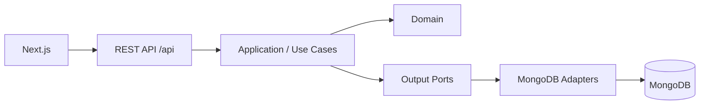

# Developer Command Center

Portfólio profissional interativo de **Alan Christofer**, construído como uma aplicação Full Stack real para demonstrar Java, Spring Boot, arquitetura, frontend moderno, segurança e entrega por containers.

> Live Demo: configure a URL após o primeiro deploy.

## Architecture



O domínio Java não depende de Spring, MongoDB ou HTTP. Controllers chamam portas de entrada; casos de uso dependem de interfaces; adapters implementam persistência e segurança. A representação interativa fica em `/architecture`.

## Tech Stack

- Java 21, Spring Boot 4.1.1, Spring Security, JWT, Bean Validation, Spring Data MongoDB
- OpenAPI/Swagger, Actuator, Micrometer/Prometheus, JUnit, Mockito e Testcontainers
- Next.js 16, React 19, TypeScript, TanStack Query, Tailwind CSS, Radix UI, Three.js e React Three Fiber
- Docker Compose, GitLab CI e Kubernetes

## How to Run

```bash
cp .env.example .env
# troque JWT_SECRET e ADMIN_PASSWORD
docker compose up --build
```

- Frontend: http://localhost:3000
- API: http://localhost:8080/api/profile
- Swagger UI: http://localhost:8080/swagger-ui.html
- Actuator health: http://localhost:8080/actuator/health

Para desenvolvimento sem containers, execute MongoDB e use `./mvnw spring-boot:run`; em outro terminal, `cd frontend && npm install && npm run dev`.

## Tests

```bash
./mvnw test
cd frontend && npm test && npm run build
```

Os testes de integração usam MongoDB Testcontainers e são ignorados automaticamente quando Docker não está disponível.

## Docker, CI/CD and Kubernetes

`docker-compose.yml` sobe MongoDB, backend e frontend com health checks. `.gitlab-ci.yml` bloqueia a entrega em falhas de teste/build e valida as duas imagens. Para Kubernetes, crie `portfolio-secrets` a partir de `k8s/secret.example.yaml`, ajuste imagens/URLs e aplique `k8s/`.

Kafka e PostgreSQL não fazem parte do runtime: serão adicionados somente quando eventos de visualização ou um caso relacional real justificarem a complexidade. O projeto está pronto para imagens em ECR e execução futura em ECS/EKS, sem criar recursos pagos ou acoplar o domínio à AWS.

## Configuration

Perfil, links, experiências e projetos podem ser atualizados pelos endpoints `/api/admin/**` com token obtido em `POST /api/auth/login`. Nenhum segredo deve ser enviado ao frontend ou versionado.

Para o avatar personalizado, coloque o arquivo em `frontend/public/models/avatar.glb`; a experiência possui fallback automático.
