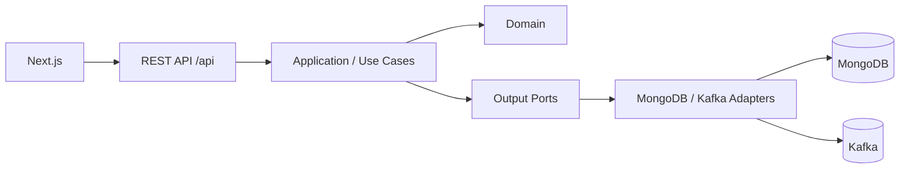
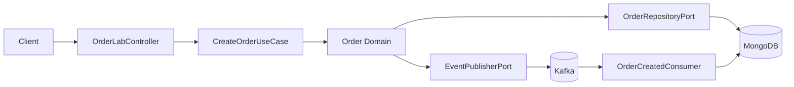

# Developer Command Center

Portfólio profissional interativo de **Alan Christofer**, construído como uma aplicação Full Stack real para demonstrar Java, Spring Boot, arquitetura, frontend moderno, segurança e entrega por containers.

> Live Demo: configure a URL após o primeiro deploy.

## Architecture


```mermaid
flowchart LR
    UI[Next.js] --> API[REST API /api]
    API --> UC[Application / Use Cases]
    UC --> D[Domain]
    UC --> P[Output Ports]
    P --> A[MongoDB / Kafka Adapters]
    A --> DB[(MongoDB)]
    A --> K[(Kafka)]
```

O domínio Java não depende de Spring, MongoDB ou HTTP. Controllers chamam portas de entrada; casos de uso dependem de interfaces; adapters implementam persistência e segurança. A representação interativa fica em `/architecture`.

## Tech Stack

- Java 21, Spring Boot 4.1.1, Spring Security, JWT, Bean Validation, Spring Data MongoDB e Spring Kafka
- OpenAPI/Swagger, Actuator, Micrometer/Prometheus, JUnit, Mockito e Testcontainers
- Next.js 16, React 19, TypeScript, TanStack Query, Tailwind CSS, Radix UI, Three.js e React Three Fiber
- Docker Compose, GitLab CI e Kubernetes

## How to Run

```bash
cp .env.example .env
# troque JWT_SECRET e ADMIN_PASSWORD
docker compose up --build
```

- Frontend: http://localhost:3000
- API: http://localhost:8080/api/profile
- Swagger UI via frontend: http://localhost:3000/swagger
- Actuator health: http://localhost:8080/actuator/health

Para desenvolvimento sem containers, execute MongoDB e Kafka e use `./mvnw spring-boot:run`; em outro terminal, `cd frontend && npm install && npm run dev`.

## Java Engineering Lab

O destino **Java Engineering Lab** transforma o portfólio em uma demonstração executável de backend. `POST /api/lab/orders` recebe um pedido demonstrativo, aplica Bean Validation, executa o caso de uso sem dependências de infraestrutura, persiste no MongoDB, publica `OrderCreatedEvent` no tópico `order-created` e conclui o processamento em um consumer Kafka.


```mermaid
flowchart LR
    Client --> REST[OrderLabController]
    REST --> UC[CreateOrderUseCase]
    UC --> Domain[Order Domain]
    Domain --> RP[OrderRepositoryPort]
    Domain --> EP[EventPublisherPort]
    RP --> Mongo[(MongoDB)]
    EP --> Kafka[(Kafka)]
    Kafka --> Consumer[OrderCreatedConsumer]
    Consumer --> Mongo
```

- Trace real por `traceId`, propagado no header `X-Trace-Id`, logs e evento Kafka.
- Etapas e durações persistidas pelo backend, consultáveis em `GET /api/lab/orders/{id}/trace`.
- Health real de Spring Boot, MongoDB e Kafka em `GET /api/lab/system-health`.
- Métricas Micrometer `portfolio.lab.orders.*`, disponíveis também no Prometheus.
- Pedidos e traces expiram automaticamente após 24 horas por índices TTL.
- A publicação aguarda acknowledgement do Kafka; uma falha marca o pedido como `FAILED` e retorna `503`. Uma evolução futura recomendada é o Outbox Pattern para atomicidade entre MongoDB e Kafka.

Para executar o laboratório completo, use `docker compose up --build`. MongoDB e Kafka são iniciados com health checks antes do backend. Os manifests Kubernetes atuais não incluem Kafka; para um cluster real, deve-se usar um broker gerenciado ou adicionar um operador Kafka conforme o ambiente, sem simular infraestrutura.

## Tests

```bash
./mvnw test
cd frontend && npm test && npm run build
```

Os testes de integração usam MongoDB e Kafka Testcontainers e são ignorados automaticamente quando Docker não está disponível.

## Docker, CI/CD and Kubernetes

`docker-compose.yml` sobe MongoDB, Kafka, backend e frontend com health checks. `.gitlab-ci.yml` bloqueia a entrega em falhas de teste/build e valida as duas imagens. Para Kubernetes, crie `portfolio-secrets` a partir de `k8s/secret.example.yaml`, ajuste imagens/URLs e aplique `k8s/`.

Kafka faz parte do runtime exclusivamente para o fluxo real de pedidos do Engineering Lab. PostgreSQL permanece fora deste runtime porque ainda não existe um caso relacional que justifique sua inclusão. O projeto está pronto para imagens em ECR e execução futura em ECS/EKS, sem criar recursos pagos ou acoplar o domínio à AWS.

## Configuration

Perfil, links, experiências e projetos podem ser atualizados pelos endpoints `/api/admin/**` com token obtido em `POST /api/auth/login`. Nenhum segredo deve ser enviado ao frontend ou versionado.

As texturas do globo estão em `frontend/public/textures/earth/` e os destinos são definidos em `frontend/src/features/globe/destinations.ts`.
