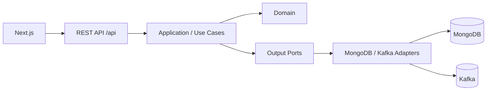
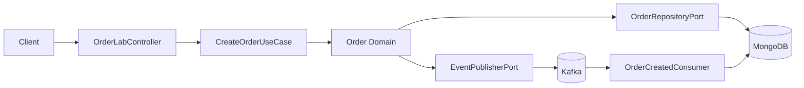

# Tech World

Portfólio profissional interativo de Alan Christofer, construído como uma aplicação Full Stack real para apresentar trajetória, projetos e demonstrar engenharia de software com Java, Spring Boot e tecnologias modernas.

> Live Demo: deployment pending

## Architecture


```mermaid
flowchart LR
    UI[Next.js] --> API[REST API /api]
    API --> UC[Application / Use Cases]
    UC --> D[Domain]
    UC --> P[Output Ports]
    P --> A[MongoDB / Kafka Adapters]
    A --> DB[(MongoDB)]
    A --> K[(Kafka)]
```

O domínio Java não depende de Spring, MongoDB ou HTTP. Controllers chamam portas de entrada; casos de uso dependem de interfaces; adapters implementam persistência, mensageria e segurança. A representação interativa está disponível em `/architecture`.

## Tech Stack

- Java 21, Spring Boot 4.1.1, Spring Security, JWT, Bean Validation, Spring Data MongoDB e Spring Kafka
- OpenAPI/Swagger, Actuator, Micrometer/Prometheus, JUnit, Mockito e Testcontainers
- Next.js 16, React 19, TypeScript, TanStack Query, Tailwind CSS, Radix UI, Three.js e React Three Fiber
- Docker Compose, GitHub Actions e GitLab CI

## How to Run

```bash
cp .env.example .env
# Troque JWT_SECRET e ADMIN_PASSWORD antes de iniciar.
docker compose up --build
```

- Frontend: http://localhost:3000
- API: http://localhost:8080/api/profile
- Swagger UI via frontend: http://localhost:3000/swagger
- Readiness: http://localhost:8080/actuator/health/readiness

Para executar sem containers, inicie MongoDB e Kafka, rode `./mvnw spring-boot:run` e, em outro terminal, `cd frontend && npm install && npm run dev`.

## Java Engineering Lab

O **Java Engineering Lab** é uma demonstração técnica do próprio Tech World. `POST /api/lab/orders` valida e persiste um pedido no MongoDB, publica `OrderCreatedEvent` no Kafka e conclui o processamento de forma assíncrona.


```mermaid
flowchart LR
    Client --> REST[OrderLabController]
    REST --> UC[CreateOrderUseCase]
    UC --> Domain[Order Domain]
    Domain --> RP[OrderRepositoryPort]
    Domain --> EP[EventPublisherPort]
    RP --> Mongo[(MongoDB)]
    EP --> Kafka[(Kafka)]
    Kafka --> Consumer[OrderCreatedConsumer]
    Consumer --> Mongo
```

- Trace real por `traceId`, propagado no header `X-Trace-Id`, logs e evento Kafka.
- Etapas consultáveis em `GET /api/lab/orders/{id}/trace`.
- Health de Spring Boot, MongoDB e Kafka em `GET /api/lab/system-health`.
- Métricas `portfolio.lab.orders.*` disponíveis no Actuator Prometheus protegido.
- Pedidos e traces expiram após 24 horas por índices TTL do MongoDB.
- O POST público possui rate limit leve por IP; excesso retorna HTTP 429.

Java 21 e Spring Boot representam a evolução técnica demonstrada pelo Tech World e pelo Java Engineering Lab. Não são apresentados como experiência profissional na Plansul.

## Production Architecture

```text
Next.js
   ↓
Spring Boot
├── MongoDB
└── Kafka
```

- Frontend: Vercel ou outro runtime compatível com Next.js.
- Backend: serviço de container/cloud com Java 21.
- Persistência: MongoDB Atlas ou MongoDB compatível.
- Mensageria: serviço Kafka gerenciado compatível com SASL/SSL.

O profile de produção é ativado com `SPRING_PROFILES_ACTIVE=prod`. O desenvolvimento local permanece no profile `local` e continua disponível por Docker Compose. Variáveis, ordem de provisionamento e smoke test estão documentados em [docs/deployment.md](docs/deployment.md).

## Tests

```bash
./mvnw test
cd frontend
npm test
npm run build
```

Os testes de integração utilizam MongoDB e Kafka com Testcontainers quando Docker está disponível.

## CI

- `.github/workflows/ci.yml`: executa testes do backend e tipagem/build do frontend em pushes e pull requests.
- `.gitlab-ci.yml`: mantém testes, builds e validação das imagens Docker.
- Nenhum pipeline realiza deploy automático.

## Configuration

Perfil, links, experiências e projetos podem ser atualizados pelos endpoints `/api/admin/**` com JWT de administrador. Em produção, o seeder realiza somente bootstrap de coleções vazias e nunca substitui conteúdo já administrado.

Nenhum segredo deve ser enviado ao frontend ou versionado. Use `.env.example` apenas como referência local e configure secrets diretamente no provedor cloud.
