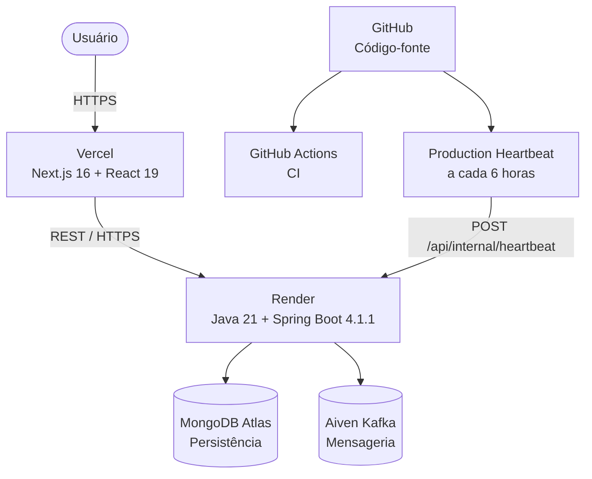
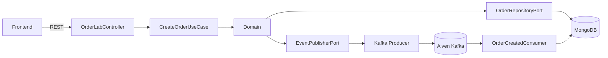

# Tech World

**Interactive Developer Portfolio & Java Engineering Lab**

Tech World é o portfólio Full Stack de Alan Christofer. A aplicação reúne trajetória profissional, projetos, habilidades e arquitetura em uma experiência interativa, enquanto o Java Engineering Lab demonstra, de forma prática, APIs REST, persistência, mensageria, observabilidade, CI e deploy cloud.

Não é apenas uma página estática: frontend, backend, banco de dados, Kafka e automações de produção formam um sistema real e implantado.

## Acesso

| Recurso | Link |
|---|---|
| Aplicação | [tech-world-opal.vercel.app](https://tech-world-opal.vercel.app) |
| API | [tech-world-api-kr5w.onrender.com](https://tech-world-api-kr5w.onrender.com) |
| Health | [GET /api/health](https://tech-world-api-kr5w.onrender.com/api/health) |
| Swagger | [OpenAPI / Swagger UI](https://tech-world-api-kr5w.onrender.com/swagger-ui/index.html) |
| Código-fonte | [github.com/AlanChristofer/tech-world](https://github.com/AlanChristofer/tech-world) |
| Operação | [Production Guide](docs/production-guide.md) |

> O backend utiliza o plano Free do Render. A primeira requisição após um período sem atividade pode sofrer cold start.

## Arquitetura


```mermaid
flowchart TB
    User([Usuário]) -->|HTTPS| Vercel[Vercel<br/>Next.js 16 + React 19]
    Vercel -->|REST / HTTPS| Render[Render<br/>Java 21 + Spring Boot 4.1.1]
    Render --> Mongo[(MongoDB Atlas<br/>Persistência)]
    Render --> Kafka[(Aiven Kafka<br/>Mensageria)]

    GitHub[GitHub<br/>Código-fonte] --> CI[GitHub Actions<br/>CI]
    GitHub --> Heartbeat[Production Heartbeat<br/>a cada 6 horas]
    Heartbeat -->|POST /api/internal/heartbeat| Render
```

O frontend e o backend possuem deploy independente. O backend stateless acessa MongoDB Atlas e Aiven Kafka; o GitHub Actions valida o código e executa o heartbeat de produção.

## Stack

### Backend

- Java 21 e Spring Boot 4.1.1
- Spring MVC, Spring Security, JWT e Bean Validation
- Spring Data MongoDB e Spring Kafka
- Arquitetura Hexagonal / Clean Architecture
- OpenAPI/Swagger, Actuator e Micrometer/Prometheus
- JUnit, Mockito e Testcontainers 2.0.3
- Docker

### Frontend

- Next.js 16.3.5, React 19.2.8 e TypeScript 7.0.2
- Tailwind CSS 4.3.3
- TanStack Query 5.103.2 e Radix UI 1.3.3
- Three.js 0.186.0, React Three Fiber 9.7.0 e Drei 10.7.8

### Infraestrutura

- Vercel, Render, MongoDB Atlas e Aiven Kafka
- Docker / Docker Compose
- GitHub Actions

## Java Engineering Lab

O Lab é uma demonstração técnica do portfólio, não uma alegação de experiência profissional. Ele executa um fluxo real com persistência e processamento assíncrono:


```mermaid
flowchart LR
    Frontend -->|REST| Controller[OrderLabController]
    Controller --> UseCase[CreateOrderUseCase]
    UseCase --> Domain[Domain]
    Domain --> Repository[OrderRepositoryPort]
    Repository --> Mongo[(MongoDB)]
    Domain --> Events[EventPublisherPort]
    Events --> Producer[Kafka Producer]
    Producer --> Kafka[(Aiven Kafka)]
    Kafka --> Consumer[OrderCreatedConsumer]
    Consumer --> Mongo
```

- `traceId` correlaciona resposta, etapas persistidas, evento e logs.
- Pedidos e traces são retidos por 24 horas e removidos por índices TTL.
- O endpoint de criação possui rate limiting por instância no profile de produção.
- Health do Lab verifica aplicação, MongoDB e Kafka.
- Producer e consumer usam o mesmo tópico `order-created`.

## Production Heartbeat

```text
GitHub Actions
  → POST /api/internal/heartbeat
  → Spring Boot
  → Kafka Producer
  → Aiven / tech-world-heartbeat
  → Heartbeat Consumer
```

O workflow [`.github/workflows/production-heartbeat.yml`](.github/workflows/production-heartbeat.yml) roda manualmente ou a cada 6 horas. Ele publica um evento Kafka real, valida o caminho entre producer e consumer e acorda o serviço do Render durante a execução. Isso **não** impede permanentemente o sleep do plano Free.

## CI

O workflow [`.github/workflows/ci.yml`](.github/workflows/ci.yml) é executado em pushes e pull requests:

- backend: Java 21 + `./mvnw test`;
- frontend: Node.js 22 + `npm ci`, `npm test` e `npm run build`.

O CI valida o projeto; ele não realiza deploy automaticamente.

## Segurança

- Secrets permanecem fora do Git e são configurados nos provedores.
- Endpoints administrativos usam JWT com role `ADMIN`.
- CORS aceita somente origens explícitas.
- MongoDB Atlas restringe o acesso de rede.
- Kafka usa usuário dedicado e ACLs de menor privilégio.
- Frontend e backend se comunicam por HTTPS em produção.

## Executando localmente

Pré-requisito: Docker com Docker Compose.

```bash
cp .env.example .env
# Substitua os placeholders locais de JWT_SECRET e ADMIN_PASSWORD.
docker compose up --build
```

| Serviço | URL local |
|---|---|
| Frontend | http://localhost:3000 |
| API | http://localhost:8080 |
| Health | http://localhost:8080/api/health |
| Swagger | http://localhost:8080/swagger-ui/index.html |
| Readiness | http://localhost:8080/actuator/health/readiness |

Para encerrar:

```bash
docker compose down
```

## Documentação completa

> Para provisionamento, manutenção, segurança, troubleshooting e reconstrução completa da infraestrutura, consulte o [Production Guide](docs/production-guide.md).
