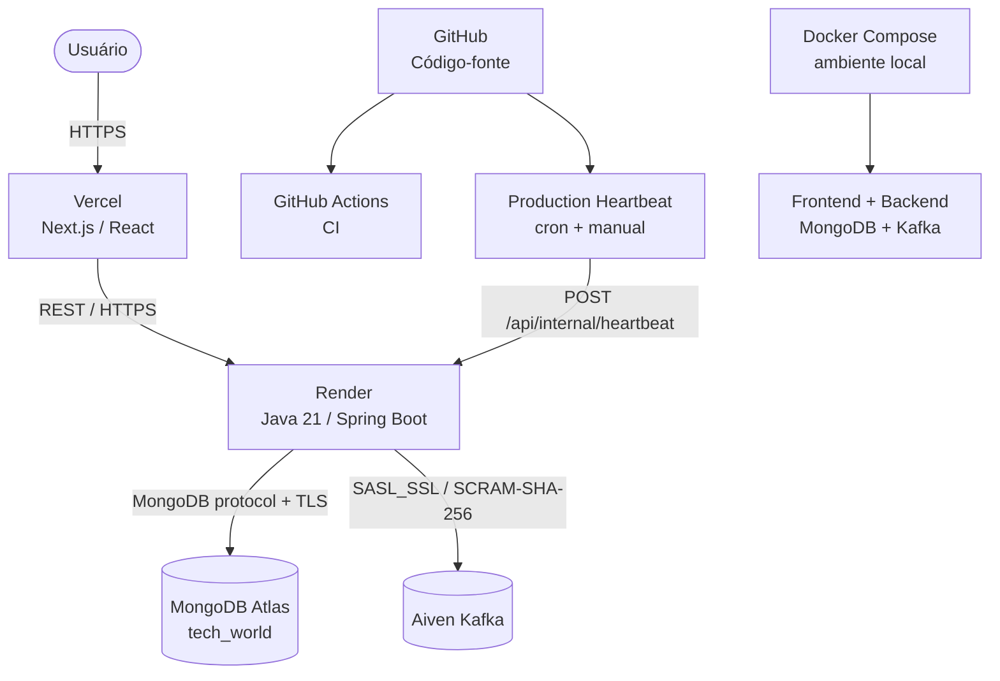
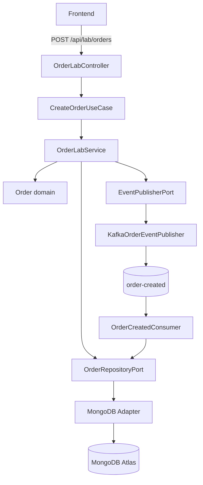
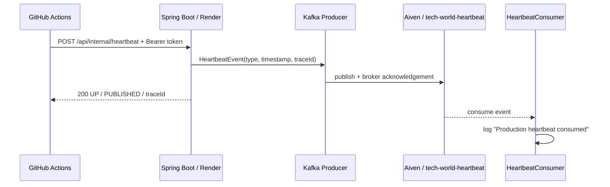

# Tech World — Production Guide

Este é o manual operacional da infraestrutura de produção do Tech World. O objetivo é permitir que a produção seja compreendida, mantida ou reconstruída sem depender de conhecimento informal.

Nenhum valor secreto deve ser copiado para este documento. Exemplos usam somente nomes de variáveis, identificadores públicos e placeholders.

## Índice

1. [Visão geral da arquitetura](#1-visão-geral-da-arquitetura)
2. [Decisões de arquitetura](#2-decisões-de-arquitetura)
3. [MongoDB Atlas](#3-mongodb-atlas)
4. [Aiven Kafka](#4-aiven-kafka)
5. [Render](#5-render)
6. [Vercel](#6-vercel)
7. [Docker local](#7-docker-local)
8. [Java Engineering Lab](#8-java-engineering-lab)
9. [Production Heartbeat](#9-production-heartbeat)
10. [GitHub Actions / CI](#10-github-actions--ci)
11. [Swagger / OpenAPI](#11-swagger--openapi)
12. [Spring Boot Actuator](#12-spring-boot-actuator)
13. [Segurança](#13-segurança)
14. [Variáveis de ambiente](#14-variáveis-de-ambiente)
15. [Troubleshooting](#15-troubleshooting)
16. [Checklists operacionais](#16-checklists-operacionais)
17. [Reconstruindo produção do zero](#17-reconstruindo-produção-do-zero)
18. [Links administrativos](#18-links-administrativos)
19. [Validação final](#19-validação-final)

---

## 1. Visão geral da arquitetura



### Componentes e responsabilidades

| Componente | Responsabilidade | Comunicação principal |
|---|---|---|
| Vercel | Hospeda o frontend Next.js | HTTPS com navegador e backend |
| Render | Executa o container stateless do backend Spring Boot | REST, MongoDB e Kafka |
| MongoDB Atlas | Persiste conteúdo do portfólio, usuários administrativos, pedidos e traces do Lab | Driver MongoDB com URI protegida |
| Aiven Kafka | Transporta eventos do Lab e heartbeat | SASL_SSL com SCRAM-SHA-256 |
| GitHub | Versiona código e documentação | Git e integrações dos provedores |
| GitHub Actions | Executa CI e heartbeat agendado | Maven, npm e HTTPS |
| Docker Compose | Reproduz a stack local | Rede Docker privada e portas locais |
| Swagger/OpenAPI | Documenta e permite testar a API REST | `/swagger-ui/index.html` |
| Actuator | Expõe health, probes e métricas | `/actuator/**` |

Fluxo de produção: o navegador carrega o Next.js pela Vercel; requisições à API seguem por HTTPS ao Render; o backend lê e grava no Atlas e publica/consome eventos na Aiven. A máquina do desenvolvedor não participa desse caminho.

## 2. Decisões de arquitetura

### Deploy independente de frontend e backend

Vercel e Render possuem ciclos de deploy separados. Isso permite alterar a interface sem reconstruir o backend e vice-versa. O custo é manter URL da API e CORS sincronizados quando um domínio muda.

### Backend stateless

O backend não depende de sessão HTTP em memória. A autenticação administrativa usa JWT, e o estado durável fica no MongoDB/Kafka. Assim, reiniciar ou substituir o container não deve apagar dados. Rate limiting, porém, é por instância e mantido em memória; reinício ou múltiplas réplicas não compartilham seu contador.

### Dados e mensageria fora do container

MongoDB Atlas e Aiven Kafka são serviços gerenciados. O container pode ser recriado sem carregar volumes de produção e sem depender da máquina do desenvolvedor. Em contrapartida, disponibilidade, rede, credenciais e limites dos planos desses provedores tornam-se dependências operacionais.

### Secrets nos provedores

Render, Vercel e GitHub guardam suas próprias variáveis/segredos. O certificado da Aiven é um Render Secret File. Isso evita incluir credenciais na imagem ou no Git, mas exige manter os valores consistentes ao rotacioná-los.

### Usuário Kafka dedicado

`techworld-app` possui somente `readwrite` nos tópicos usados pela aplicação. O backend não utiliza o usuário administrativo da Aiven. Esse menor privilégio reduz o impacto de uma credencial comprometida e implica que tópicos/ACLs são provisionados fora da aplicação em produção.

### Escolha dos serviços

- **Vercel:** integração direta com Next.js, CDN e deploy independente do frontend.
- **Render:** executa o Dockerfile Java e fornece URL, logs e health check. O plano Free pode entrar em sleep e gerar cold start.
- **MongoDB Atlas:** persistência gerenciada compatível com Spring Data MongoDB e índices TTL.
- **Aiven:** Kafka gerenciado com TLS, SASL e ACLs.

Essas são escolhas adequadas ao escopo do portfólio, não a única arquitetura possível.

## 3. MongoDB Atlas

### Estado atual

| Item | Valor não secreto |
|---|---|
| Cluster | `TechWorld` |
| Database | `tech_world` |
| Database user | `techworld` |
| Variável no backend | `MONGODB_URI` |
| Network Access | IP local autorizado, `74.220.50.0/24` e `74.220.58.0/24` |

As faixas CIDR acima são as atualmente usadas para permitir a saída de rede do Render. Se a infraestrutura do serviço mudar, confira os endereços de saída informados pelo provedor antes de alterar a allowlist. Não use `0.0.0.0/0` como atalho: ele permite tentativa de conexão a partir de qualquer origem.

### Provisionamento

1. Entre no MongoDB Atlas e crie um projeto, se necessário.
2. Crie o cluster `TechWorld`.
3. Em **Database Access**, crie o usuário `techworld` com permissão somente no banco necessário.
4. Gere uma senha forte e armazene-a diretamente no secret `MONGODB_URI` do Render.
5. Em **Network Access**, autorize o IP local necessário e as faixas de saída do Render.
6. Obtenha a connection string do driver Java/Spring.
7. Troque os placeholders de usuário, senha e database; use `tech_world` como database.
8. Salve a URI completa em `MONGODB_URI` no Render. Não a escreva em arquivo versionado.
9. Faça deploy/redeploy e valide `/actuator/health/readiness` e os logs.

### Validação e diagnóstico

- Confirme o nome do cluster, database e usuário.
- Verifique se a senha foi codificada corretamente na URI quando contém caracteres reservados.
- Confirme que as faixas do Render continuam na allowlist.
- Procure nos logs erros de autenticação, timeout, DNS ou seleção de servidor.
- Compare `/api/health` com `/actuator/health/readiness`: o primeiro só confirma que a API respondeu; readiness inclui MongoDB e Kafka.

### TTL do Java Engineering Lab

`lab_orders` e `lab_order_traces` possuem índice TTL sobre `expiresAt`. O código define expiração 24 horas após a criação do pedido/trace, e `expireAfter = 0s` faz o MongoDB remover o documento quando o instante armazenado é alcançado. A remoção pelo monitor TTL do MongoDB não é necessariamente instantânea.

## 4. Aiven Kafka

### Estado atual

| Item | Valor não secreto |
|---|---|
| Service | `tech-world-kafka` |
| Broker | `tech-world-kafka-tech-world.b.aivencloud.com:28272` |
| Security protocol | `SASL_SSL` |
| SASL mechanism | `SCRAM-SHA-256` |
| Application user | `techworld-app` |
| CA | `ca.pem` |
| Tópicos | `order-created`, `tech-world-heartbeat` |

ACLs esperadas:

| Usuário | Permissão | Tópico |
|---|---|---|
| `techworld-app` | `readwrite` | `order-created` |
| `techworld-app` | `readwrite` | `tech-world-heartbeat` |

A aplicação nunca deve receber a credencial administrativa da Aiven.

### Provisionamento

1. No console Aiven, crie o serviço Kafka `tech-world-kafka`.
2. Crie o service/application user `techworld-app`.
3. Crie previamente `order-created` e `tech-world-heartbeat`.
4. Conceda ao usuário `readwrite` apenas nesses dois tópicos.
5. Baixe o certificado CA do serviço como `ca.pem`.
6. Copie o broker para `SPRING_KAFKA_BOOTSTRAP_SERVERS` no Render.
7. Configure `KAFKA_SECURITY_PROTOCOL=SASL_SSL`.
8. Configure `KAFKA_SASL_MECHANISM=SCRAM-SHA-256`.
9. Cadastre usuário e senha nas variáveis protegidas do Render.
10. Crie o Secret File `ca.pem` no Render e aponte `KAFKA_SSL_TRUSTSTORE_LOCATION` para `/etc/secrets/ca.pem`.
11. Faça deploy e valide producer, consumer e readiness.

Em `prod`, `spring.kafka.admin.auto-create` é `false`. As classes `KafkaLabConfig` e `HeartbeatKafkaConfig` declaram `NewTopic`, mas a criação automática fica desativada no profile de produção; por isso os tópicos devem existir na Aiven e a aplicação não precisa de privilégio administrativo.

### Configuração Spring usada pelo projeto

Quando `KAFKA_SECURITY_PROTOCOL=SASL_SSL`, o Spring importa `kafka-SASL_SSL.yml`. Esse arquivo configura `ScramLoginModule`, mecanismo SCRAM, usuário/senha e truststore PEM. O producer e os dois consumers reutilizam a autoconfiguração única do Spring Kafka.

Variáveis relacionadas:

- `SPRING_KAFKA_BOOTSTRAP_SERVERS`
- `KAFKA_SECURITY_PROTOCOL`
- `KAFKA_SASL_MECHANISM`
- `KAFKA_SASL_USERNAME`
- `KAFKA_SASL_PASSWORD`
- `KAFKA_SSL_TRUSTSTORE_LOCATION`
- `KAFKA_SSL_TRUSTSTORE_TYPE`
- `ORDER_CREATED_TOPIC`
- `HEARTBEAT_TOPIC`

### Validação

1. Abra `/actuator/health/readiness`: o componente Kafka deve estar pronto.
2. Execute um pedido pelo Lab e consulte seu trace.
3. Confirme `EVENT_PUBLISHED`, `EVENT_CONSUMED` e `ORDER_PROCESSED`.
4. Execute o Production Heartbeat manualmente.
5. Nos logs do Render, procure `Production heartbeat consumed`.

## 5. Render

### Estado atual

| Item | Configuração |
|---|---|
| Service | `tech-world-api` |
| URL | https://tech-world-api-kr5w.onrender.com |
| Plano | Free |
| Root Directory | vazio |
| Docker Build Context | raiz do repositório |
| Dockerfile | `backend/Dockerfile` |
| Health Check Path | `/api/health` |
| Spring profile | `SPRING_PROFILES_ACTIVE=prod` |
| Memória Java | `JAVA_TOOL_OPTIONS=-Xms128m -Xmx320m` |
| Kafka Secret File | `ca.pem` em `/etc/secrets/ca.pem` |

O Dockerfile constrói o projeto com Maven/Java 21 e executa o JAR como usuário `spring` não-root. O usuário pertence ao grupo GID 1000 para ler Secret Files do Render. O `ENTRYPOINT` também usa `-XX:MaxRAMPercentage=75`; `JAVA_TOOL_OPTIONS` é lido automaticamente pela JVM e fixa o heap atual em 128–320 MB. Nenhum certificado é copiado para a imagem.

### Criação do Web Service

1. Em Render, crie um **Web Service** conectado ao repositório GitHub.
2. Escolha runtime Docker.
3. Deixe **Root Directory** vazio.
4. Defina o Dockerfile como `backend/Dockerfile`; o contexto deve ser a raiz do repositório.
5. Selecione o plano Free.
6. Configure `/api/health` como Health Check Path.
7. Cadastre as variáveis da seção [14](#14-variáveis-de-ambiente).
8. Em **Secret Files**, crie `ca.pem`. O arquivo ficará disponível em `/etc/secrets/ca.pem`.
9. Configure `KAFKA_SSL_TRUSTSTORE_LOCATION=/etc/secrets/ca.pem`.
10. Faça o deploy e acompanhe build, start e readiness nos logs.

### Variáveis essenciais no Render

- **Aplicação:** `SPRING_PROFILES_ACTIVE`, `JAVA_TOOL_OPTIONS`, porta quando fornecida pelo provedor.
- **MongoDB:** `MONGODB_URI`.
- **JWT/admin:** `JWT_SECRET`, `JWT_TOKEN_TTL`, `ADMIN_USERNAME`, `ADMIN_PASSWORD`.
- **CORS:** `CORS_ALLOWED_ORIGINS` com localhost e domínio Vercel explícitos.
- **Kafka:** broker, protocolo, mecanismo, usuário, senha, CA/tipo e nomes dos tópicos.
- **Heartbeat:** `HEARTBEAT_TOKEN` e `HEARTBEAT_TOPIC`.

### Deploy, redeploy e observação

- Um commit pode disparar novo deploy conforme a integração configurada no Render.
- Para repetir a versão/configuração atual, use o redeploy pelo dashboard.
- Para voltar a uma implantação anterior, use os recursos de deploy/rollback disponibilizados pelo dashboard do serviço.
- Leia primeiro os logs de build; depois, os logs de runtime.
- Valide `/api/health`, `/actuator/health/liveness` e `/actuator/health/readiness`.

No plano Free, o serviço pode dormir sem tráfego. A primeira chamada precisa aguardar a inicialização do container e das conexões externas. O heartbeat o acorda quando executa, mas não garante disponibilidade contínua nem elimina permanentemente o sleep.

## 6. Vercel

### Estado atual

| Item | Configuração |
|---|---|
| URL | https://tech-world-opal.vercel.app |
| Root Directory | `frontend` |
| Framework | Next.js |
| `API_URL` | URL HTTPS do backend Render |
| `NEXT_PUBLIC_API_URL` | URL HTTPS do backend Render |
| `NEXT_PUBLIC_SITE_URL` | URL HTTPS do frontend Vercel |

`API_URL` é usada no lado servidor/proxies Next.js. `NEXT_PUBLIC_API_URL` está disponível no build e também serve como fallback para o acesso à API. `NEXT_PUBLIC_SITE_URL` alimenta metadata/canonical/sitemap. O proxy aceita ainda `BACKEND_URL` como alias opcional, mas a configuração atual usa `API_URL`.

### Provisionamento

1. Importe o repositório GitHub na Vercel.
2. Selecione `frontend` como Root Directory.
3. Confirme o preset Next.js.
4. Cadastre `API_URL=https://tech-world-api-kr5w.onrender.com`.
5. Cadastre `NEXT_PUBLIC_API_URL=https://tech-world-api-kr5w.onrender.com`.
6. Cadastre `NEXT_PUBLIC_SITE_URL=https://tech-world-opal.vercel.app`.
7. Faça o deploy e valide a home, navegação e Java Engineering Lab.
8. Ao trocar domínio/frontend, atualize `NEXT_PUBLIC_SITE_URL` e o CORS no Render.
9. Ao trocar o backend, atualize as duas URLs da API e faça redeploy para reconstruir valores públicos de build.

O backend deve receber:

```text
CORS_ALLOWED_ORIGINS=http://localhost:3000,https://tech-world-opal.vercel.app
```

Não use `*`: `SecurityConfig` rejeita lista vazia e wildcard.

## 7. Docker local

O `docker-compose.yml` executa quatro serviços:

- `mongodb`: MongoDB 8.0 com volume `mongodb-data`;
- `kafka`: Apache Kafka 4.0.0 em modo KRaft e PLAINTEXT na rede Docker;
- `backend`: aplicação Spring Boot no profile `local`;
- `frontend`: build standalone Next.js em Node.js 22.

No ambiente padrão, o backend usa `mongodb:27017` e `kafka:9092`. O frontend acessa o backend internamente por `API_URL=http://backend:8080`, enquanto o navegador utiliza a porta publicada.

### Comandos úteis

```bash
# Preparar configuração local
cp .env.example .env

# Subir e acompanhar logs
docker compose up --build

# Subir em segundo plano
docker compose up --build -d

# Ver status
docker compose ps

# Ver logs de toda a stack ou só do backend
docker compose logs -f
docker compose logs -f backend

# Reconstruir o backend
docker compose build backend
docker compose up -d backend

# Parar e remover containers/rede (mantém o volume nomeado)
docker compose down
```

Não use `docker compose down -v` sem intenção explícita: `-v` remove também o volume local do MongoDB e seus dados.

O Compose é ambiente de desenvolvimento/demonstração. Produção usa Vercel, Render, Atlas e Aiven e não depende de containers ou processos ativos no computador do desenvolvedor.

## 8. Java Engineering Lab

O Lab demonstra um fluxo real de criação e processamento assíncrono sem misturá-lo ao conteúdo profissional do portfólio.



### Passo a passo

1. `LabTraceFilter` cria um UUID de `traceId`, adiciona `X-Trace-Id` à resposta e inicia o trace com validade de 24 horas.
2. Bean Validation valida o DTO de entrada.
3. `OrderLabController` chama a porta `CreateOrderUseCase`.
4. `OrderLabService` cria o domínio e depende somente de portas de saída.
5. `OrderRepositoryPort` é implementada pelo adapter MongoDB e persiste o pedido com status inicial.
6. Um `OrderCreatedEvent` é criado e enviado por `EventPublisherPort`.
7. `KafkaOrderEventPublisher` aguarda acknowledgement do broker por até 5 segundos antes de responder sucesso.
8. `OrderCreatedConsumer` lê o evento, recupera o pedido e altera o status para `PROCESSED`.
9. Cada etapa relevante é anexada ao trace; logs estruturados carregam `traceId` e `orderId` quando disponíveis.

### Clean/Hexagonal

- **Domínio:** `Order`, `OrderItem`, status e eventos sem detalhes HTTP/Mongo/Kafka.
- **Portas de entrada:** casos de uso como `CreateOrderUseCase`.
- **Portas de saída:** `OrderRepositoryPort`, `OrderTracePort` e `EventPublisherPort`.
- **Adapters de entrada:** REST controller e Kafka consumer.
- **Adapters de saída:** MongoDB, Kafka producer e Micrometer.

### Endpoints do Lab

| Método | Endpoint | Uso |
|---|---|---|
| `POST` | `/api/lab/orders` | Executa criação, persistência e publicação |
| `GET` | `/api/lab/orders` | Lista pedidos ainda retidos pelo TTL |
| `GET` | `/api/lab/orders/{id}` | Consulta estado persistido |
| `GET` | `/api/lab/orders/{id}/trace` | Consulta etapas correlacionadas |
| `GET` | `/api/lab/system-health` | Componentes e métricas do Lab |

No profile `prod`, o POST aceita até 5 tentativas por minuto por endereço remoto e por instância. Excesso retorna 429 com `Retry-After`. Pedidos e traces expiram após 24 horas. Métricas `portfolio.lab.orders.*` registram requisições, criações, processamentos, falhas e latência.

## 9. Production Heartbeat

O heartbeat valida o pipeline de produção sem criar pedido nem registro permanente no MongoDB.



O endpoint é `POST /api/internal/heartbeat`. `HeartbeatTokenFilter` compara o Bearer token com `HEARTBEAT_TOKEN`; ausência/configuração inválida retorna 401. O token não deve aparecer em logs, documentação ou comandos compartilhados.

O workflow [`.github/workflows/production-heartbeat.yml`](../.github/workflows/production-heartbeat.yml):

- aceita `workflow_dispatch`;
- agenda `17 */6 * * *`, isto é, a cada 6 horas no minuto 17 (UTC no GitHub Actions);
- lê `HEARTBEAT_TOKEN` de GitHub Repository Secrets;
- falha se o endpoint não retornar 2xx;
- tenta novamente em falhas transitórias de rede.

### Execução manual

1. No GitHub, abra **Actions**.
2. Selecione **Production Heartbeat**.
3. Clique em **Run workflow** e confirme a branch.
4. Abra o job e confirme resposta 2xx.
5. Nos logs do Render, procure `Production heartbeat consumed` e correlacione pelo `traceId` quando necessário.

Resposta esperada:

```json
{
  "status": "UP",
  "kafka": "PUBLISHED",
  "traceId": "..."
}
```

Esse teste percorre GitHub Actions → Render → Spring Boot → Kafka Producer → Aiven → Kafka Consumer. Ele também acorda o Render durante a chamada, mas não mantém o plano Free permanentemente ativo.

## 10. GitHub Actions / CI

### CI

O arquivo [`.github/workflows/ci.yml`](../.github/workflows/ci.yml) roda em `push` e `pull_request`:

- job backend: Temurin Java 21, cache Maven e `./mvnw test`;
- job frontend: Node.js 22, `npm ci`, `npm test` (type check) e `npm run build`.

Ele valida código. Não há etapa de deploy nesse workflow.

### Heartbeat

O arquivo [`.github/workflows/production-heartbeat.yml`](../.github/workflows/production-heartbeat.yml) é uma verificação operacional agendada/manual. Ele não compila o projeto e não substitui CI, monitoramento ou readiness.

Cadastre em **Settings → Secrets and variables → Actions → Repository secrets**:

- `HEARTBEAT_TOKEN`: exatamente o mesmo segredo configurado no Render.

Nunca cadastre esse valor como texto no YAML.

## 11. Swagger / OpenAPI

Produção: https://tech-world-api-kr5w.onrender.com/swagger-ui/index.html

Swagger UI apresenta os contratos OpenAPI e permite executar chamadas REST. Use-o para explorar consultas públicas e o Java Engineering Lab. O heartbeat é marcado como oculto e não aparece no Swagger.

Swagger documenta a API; `/api/health` e Actuator medem disponibilidade/saúde. Eles têm propósitos diferentes.

Endpoints `/api/admin/**` exigem JWT com role `ADMIN`. Não cole tokens administrativos em capturas, issues ou logs compartilhados. Para smoke tests públicos, prefira endpoints somente leitura e o Lab.

## 12. Spring Boot Actuator

`application.yml` expõe `health`, `info` e `prometheus`:

| Endpoint | Proteção | Significado |
|---|---|---|
| `/actuator/health` | Público | Saúde agregada; detalhes só quando autorizado |
| `/actuator/health/liveness` | Público | Processo Spring está vivo |
| `/actuator/health/readiness` | Público | `readinessState`, MongoDB e Kafka estão prontos |
| `/actuator/info` | Requer autenticação pela regra geral | Informações Actuator disponíveis |
| `/actuator/prometheus` | JWT `ADMIN` | Métricas no formato Prometheus |

`/api/health` é um endpoint público leve que responde `{"status":"UP"}` quando o controller está acessível. Ele é o Health Check Path atual do Render, mas não prova que MongoDB e Kafka estejam prontos. Para diagnosticar dependências, use readiness; o indicador Kafka tenta consultar o cluster com timeout curto e reutiliza a mesma configuração de conexão da aplicação.

## 13. Segurança

### Dados que nunca devem entrar no Git

- `MONGODB_URI` quando contém usuário/senha;
- `JWT_SECRET`;
- `ADMIN_PASSWORD`;
- `KAFKA_SASL_PASSWORD`;
- `HEARTBEAT_TOKEN`;
- `ca.pem`.

O `.gitignore` protege `.env`, `secrets/` e `*.pem`. Isso é uma barreira adicional, não autorização para deixar secrets em arquivos do repositório.

### Onde cada configuração sensível fica

- **Render:** environment variables do backend e Secret File `ca.pem`.
- **GitHub:** Repository Secret `HEARTBEAT_TOKEN`.
- **Vercel:** environment variables do frontend; URLs não são secrets, mas ficam centralizadas no projeto.
- **Aiven:** usuário dedicado `techworld-app`, senha e ACLs restritas.
- **Atlas:** usuário do database, senha e Network Access.

### Controles implementados

- autenticação administrativa stateless por JWT HS256 e role `ADMIN`;
- senha administrativa armazenada com BCrypt pela aplicação;
- endpoint heartbeat protegido por token específico, separado do JWT;
- CORS apenas com origens explícitas; `*` é rejeitado na inicialização;
- HTTPS entre frontend e backend em produção;
- Kafka com SASL_SSL, SCRAM-SHA-256, CA e ACL de menor privilégio;
- MongoDB restrito por usuário e allowlist de rede;
- container executado como usuário não-root.

Evite `0.0.0.0/0` no Atlas e `*` em CORS: ambos ampliam desnecessariamente a superfície de acesso. Após qualquer exposição acidental, rotacione imediatamente a credencial no provedor e atualize os consumidores.

## 14. Variáveis de ambiente

“Obrigatória” abaixo considera o cenário indicado. Valores secretos nunca devem ser copiados para documentação ou Git.

| Variable | Service | Required | Secret? | Purpose |
|---|---|---:|---:|---|
| `SPRING_PROFILES_ACTIVE` | Backend | Sim em produção | Não | Use `prod`; Compose usa `local` |
| `MONGODB_URI` | Backend | Sim em produção | Sim | Connection string MongoDB Atlas |
| `JWT_SECRET` | Backend | Sim | Sim | Assinatura HS256; mínimo de 32 bytes |
| `JWT_TOKEN_TTL` | Backend | Não | Não | Duração ISO-8601; padrão `PT2H` |
| `ADMIN_USERNAME` | Backend | Sim em produção | Sensível | Usuário administrativo inicial |
| `ADMIN_PASSWORD` | Backend | Sim em produção | Sim | Senha do bootstrap administrativo |
| `CORS_ALLOWED_ORIGINS` | Backend | Sim em produção | Não | Origens explícitas separadas por vírgula |
| `SERVER_PORT` | Backend | Condicional | Não | Porta preferencial do servidor |
| `PORT` | Backend / provider | Condicional | Não | Fallback de porta; padrão final `8080` |
| `SPRING_KAFKA_BOOTSTRAP_SERVERS` | Backend | Sim | Não | Brokers Kafka; `kafka:9092` no Compose |
| `KAFKA_SECURITY_PROTOCOL` | Backend | Sim | Não | `PLAINTEXT` local ou `SASL_SSL` cloud |
| `KAFKA_SASL_MECHANISM` | Backend cloud | Sim | Não | `SCRAM-SHA-256` |
| `KAFKA_SASL_USERNAME` | Backend cloud | Sim | Sensível | Usuário dedicado da Aiven |
| `KAFKA_SASL_PASSWORD` | Backend cloud | Sim | Sim | Senha do usuário Kafka |
| `KAFKA_SSL_TRUSTSTORE_LOCATION` | Backend cloud | Sim | Não | Caminho do CA; no Render, `/etc/secrets/ca.pem` |
| `KAFKA_SSL_TRUSTSTORE_TYPE` | Backend cloud | Não | Não | Tipo do truststore; padrão `PEM` |
| `ORDER_CREATED_TOPIC` | Backend | Não | Não | Padrão `order-created` |
| `HEARTBEAT_TOKEN` | Backend e GitHub | Sim para heartbeat | Sim | Autoriza o endpoint interno |
| `HEARTBEAT_TOPIC` | Backend | Não | Não | Padrão `tech-world-heartbeat` |
| `JAVA_TOOL_OPTIONS` | Backend / Render | Recomendado no plano atual | Não | Limites atuais `-Xms128m -Xmx320m` |
| `API_URL` | Frontend / Vercel | Sim na configuração atual | Não | Base URL server-side do backend |
| `BACKEND_URL` | Frontend | Não | Não | Alias server-side aceito pelo proxy |
| `NEXT_PUBLIC_API_URL` | Frontend | Sim | Não | Base pública/fallback da API; aplicada no build |
| `NEXT_PUBLIC_SITE_URL` | Frontend | Sim em produção | Não | Canonical, sitemap e metadata |
| `BACKEND_PORT` | Docker Compose | Não | Não | Porta publicada do backend; padrão `8080` |
| `FRONTEND_PORT` | Docker Compose | Não | Não | Porta publicada do frontend; padrão `3000` |

No Compose, `JWT_SECRET` e `ADMIN_PASSWORD` são exigidos no `.env`; os demais possuem fallbacks locais quando indicado. Em produção, os placeholders de `.env.example` não são válidos como secrets.

## 15. Troubleshooting

### Render retorna 502

1. Confirme que o último build terminou com sucesso.
2. Verifique se o container iniciou e permaneceu ativo.
3. Confira `PORT`/`SERVER_PORT`; o app usa `SERVER_PORT`, depois `PORT`, depois `8080`.
4. Abra `/api/health`, liveness e readiness separadamente.
5. Procure `OutOfMemoryError`, encerramento por memória ou loop de restart.
6. Confirme `JAVA_TOOL_OPTIONS` e os limites do plano.
7. Verifique Atlas e Aiven: uma dependência indisponível pode derrubar readiness.
8. Considere cold start antes de concluir que há falha permanente.

### MongoDB Atlas não conecta

- valide formato, usuário, senha codificada e database da `MONGODB_URI`;
- confira Network Access e CIDRs atuais do Render;
- teste resolução DNS e procure timeout/erro de autenticação nos logs;
- confirme que o usuário `techworld` tem a permissão necessária;
- não abra `0.0.0.0/0` para contornar o diagnóstico.

### Kafka não conecta

- confirme broker e porta;
- valide `SASL_SSL` e `SCRAM-SHA-256`;
- confira usuário/senha sem imprimi-los;
- confirme `ca.pem`, caminho e tipo `PEM`;
- confira ACLs e existência dos dois tópicos;
- use readiness e logs de producer/consumer para separar falha de rede, autenticação e autorização.

### CA Kafka incorreto

Sintomas comuns: falha de handshake TLS, certificado não confiável ou arquivo ausente. Confirme que o Secret File é o CA do serviço atual, está salvo como `ca.pem`, está montado em `/etc/secrets/ca.pem`, é legível pelo usuário não-root e que `KAFKA_SSL_TRUSTSTORE_LOCATION` aponta exatamente para esse caminho. Não copie o conteúdo do certificado para logs/issues.

### Render Secret File não salvo ou montado

Abra a configuração do serviço e confirme nome/path do arquivo. Um arquivo criado fora do serviço correto ou não salvo não aparece no container. Faça redeploy depois da correção. Use mensagens de “file not found”/permissão dos logs, sem imprimir o arquivo.

### Heartbeat retorna 401

Compare a existência — não o valor em logs — de `HEARTBEAT_TOKEN` no Render e no GitHub Repository Secret. Eles devem ser idênticos. Confirme header `Authorization: Bearer <token>` e redeploy do backend após troca da variável.

### Kafka retorna erro de autorização / ACL

Confirme que `techworld-app` possui `readwrite` em `order-created` e `tech-world-heartbeat`, com grafia idêntica às variáveis. Não resolva concedendo permissão administrativa à aplicação.

### Health retorna 503 por Kafka

Se liveness está UP e readiness está DOWN, o processo Spring pode estar saudável enquanto a dependência Kafka não está pronta. Verifique broker, TLS/SASL, CA, ACL e disponibilidade Aiven. `/api/health` pode continuar 200 porque é um endpoint leve e não inclui dependências.

### Consumer Kafka não processa

- confirme tópico e grupos `portfolio-java-engineering-lab` / `tech-world-heartbeat`;
- valide permissão de leitura e publicação;
- procure logs de inicialização do listener e erros de desserialização;
- confirme que producer publicou com acknowledgement;
- no Lab, consulte trace para separar `EVENT_PUBLISHED` de `EVENT_CONSUMED`.

### Render cold start

No plano Free, a primeira requisição depois do sleep pode levar mais tempo ou falhar no cliente por timeout enquanto o serviço inicia. Aguarde e repita health/readiness. O heartbeat periódico cria atividade real, mas não é garantia de serviço sempre acordado.

## 16. Checklists operacionais

### Novo deploy

- [ ] CI verde para backend e frontend
- [ ] Nenhum secret no diff
- [ ] Variáveis do provedor conferidas
- [ ] Tópicos e ACLs existentes
- [ ] Deploy do backend concluído
- [ ] `/api/health`, liveness e readiness validados
- [ ] Deploy do frontend concluído
- [ ] Navegação e Lab validados
- [ ] Heartbeat manual concluído

### Troca de domínio frontend

- [ ] Configurar domínio na Vercel
- [ ] Atualizar `NEXT_PUBLIC_SITE_URL`
- [ ] Adicionar domínio explícito em `CORS_ALLOWED_ORIGINS`
- [ ] Manter/remover o domínio anterior de acordo com a transição
- [ ] Redeploy de frontend e backend
- [ ] Validar canonical, sitemap, CORS e Lab

### Troca de senha MongoDB

- [ ] Gerar nova senha no Atlas
- [ ] Atualizar somente `MONGODB_URI` no Render
- [ ] Redeploy do backend
- [ ] Validar readiness e consultas
- [ ] Revogar a senha anterior quando a nova estiver confirmada

### Troca de senha Kafka

- [ ] Rotacionar credencial do `techworld-app` na Aiven
- [ ] Atualizar `KAFKA_SASL_PASSWORD` no Render
- [ ] Redeploy do backend
- [ ] Validar readiness, pedido e heartbeat
- [ ] Confirmar producer e ambos os consumers

### Troca de HEARTBEAT_TOKEN

- [ ] Gerar segredo forte
- [ ] Atualizar `HEARTBEAT_TOKEN` no Render
- [ ] Atualizar o Repository Secret homônimo no GitHub
- [ ] Redeploy do backend
- [ ] Executar workflow manual
- [ ] Confirmar consumo nos logs

### Kafka não conecta

- [ ] Broker/porta corretos
- [ ] `SASL_SSL` e `SCRAM-SHA-256`
- [ ] Usuário/senha presentes
- [ ] CA montado e caminho correto
- [ ] Tópicos existentes
- [ ] ACLs `readwrite`
- [ ] Readiness e logs verificados

### Atlas não conecta

- [ ] URI/database corretos
- [ ] Usuário e senha válidos
- [ ] Senha corretamente codificada na URI
- [ ] CIDRs do Render autorizados
- [ ] DNS e logs verificados

### Render retorna 502

- [ ] Build concluído
- [ ] Container em execução
- [ ] Porta correta
- [ ] Memória/JVM verificadas
- [ ] Liveness e readiness separados
- [ ] Dependências externas verificadas
- [ ] Cold start considerado

### Alteração de domínio/backend

- [ ] Atualizar `API_URL` na Vercel
- [ ] Atualizar `NEXT_PUBLIC_API_URL` na Vercel
- [ ] Atualizar CORS no Render
- [ ] Fazer redeploy de frontend e backend
- [ ] Validar chamadas server-side e no navegador
- [ ] Atualizar links públicos desta documentação

## 17. Reconstruindo produção do zero

Use esta ordem para recuperação de desastre ou recriação completa.

1. **GitHub:** recupere o repositório, proteja acesso e confirme os dois workflows.
2. **MongoDB Atlas:** crie cluster `TechWorld`, database `tech_world`, usuário `techworld`, senha forte e Network Access restrito. Guarde a URI sem expô-la.
3. **Aiven Kafka:** crie `tech-world-kafka`, usuário `techworld-app`, tópicos `order-created` e `tech-world-heartbeat`, ACLs `readwrite` específicas e baixe `ca.pem`.
4. **Render:** crie `tech-world-api` com root vazio, contexto na raiz e `backend/Dockerfile`; configure profile `prod`, variáveis, memória, health e Secret File.
5. **Backend smoke test:** valide build, `/api/health`, liveness, readiness, Swagger e endpoints públicos.
6. **Vercel:** importe o repositório, use root `frontend`, configure as três URLs e faça deploy.
7. **CORS:** configure explicitamente localhost e o domínio Vercel no Render; redeploy.
8. **GitHub Actions:** cadastre `HEARTBEAT_TOKEN` igual ao Render e confirme CI.
9. **Java Engineering Lab:** crie pedido, consulte por ID e trace, confirme persistência/publicação/consumo/status `PROCESSED`.
10. **Heartbeat:** rode manualmente e confirme resposta 2xx e `Production heartbeat consumed`.
11. **Validação final:** confira frontend, Swagger, health, readiness, segurança, logs e ausência de secrets no Git.

Exemplo de smoke test público, sem credenciais:

```bash
curl -fsS https://tech-world-api-kr5w.onrender.com/api/health
curl -fsS https://tech-world-api-kr5w.onrender.com/api/profile
curl -fsS https://tech-world-api-kr5w.onrender.com/api/projects
curl -fsS https://tech-world-api-kr5w.onrender.com/api/lab/system-health
```

Para testar `POST /api/lab/orders`, use o contrato atual exibido no Swagger. Depois consulte `/api/lab/orders/{id}` e `/api/lab/orders/{id}/trace` até observar o processamento assíncrono.

## 18. Links administrativos

### Consoles

- Vercel: https://vercel.com/dashboard
- Render: https://dashboard.render.com
- MongoDB Atlas: https://cloud.mongodb.com
- Aiven: https://console.aiven.io
- GitHub: https://github.com

### Produção

- Frontend: https://tech-world-opal.vercel.app
- Backend: https://tech-world-api-kr5w.onrender.com
- Health: https://tech-world-api-kr5w.onrender.com/api/health
- Swagger: https://tech-world-api-kr5w.onrender.com/swagger-ui/index.html
- Repositório: https://github.com/AlanChristofer/tech-world

## 19. Validação final

Antes de aprovar uma mudança de documentação ou infraestrutura:

- [ ] Conferir `README.md`
- [ ] Conferir `docs/production-guide.md`
- [ ] Não remover ou sobrescrever `docs/deployment.md`
- [ ] Verificar links Markdown e blocos Mermaid
- [ ] Confirmar que nenhum secret real foi escrito
- [ ] Comparar env vars com `application*.yml`, código e `.env.example`
- [ ] Comparar endpoints com os controllers e `SecurityConfig`
- [ ] Conferir `docker-compose.yml` e Dockerfiles
- [ ] Conferir os dois workflows do GitHub Actions
- [ ] Validar URLs de produção e CORS explícito
- [ ] Confirmar que nenhuma alteração funcional foi incluída

### Nota sobre a documentação anterior

`docs/deployment.md` é mantido como histórico e referência existente. Ele menciona `KAFKA_SASL_LOGIN_MODULE` e mecanismo padrão `PLAIN`; a implementação atual não lê essa variável. O arquivo `kafka-SASL_SSL.yml` usa `org.apache.kafka.common.security.scram.ScramLoginModule` e `SCRAM-SHA-256`, conforme a configuração Aiven descrita neste guia.
